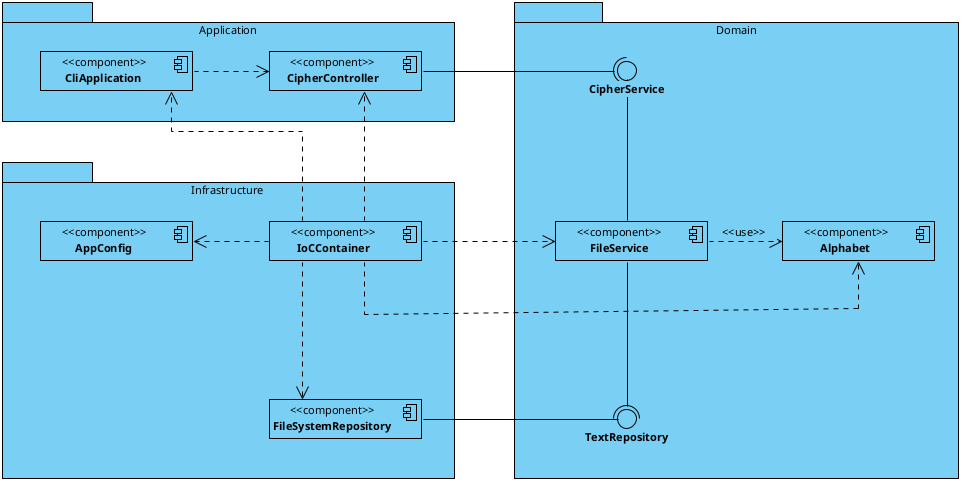
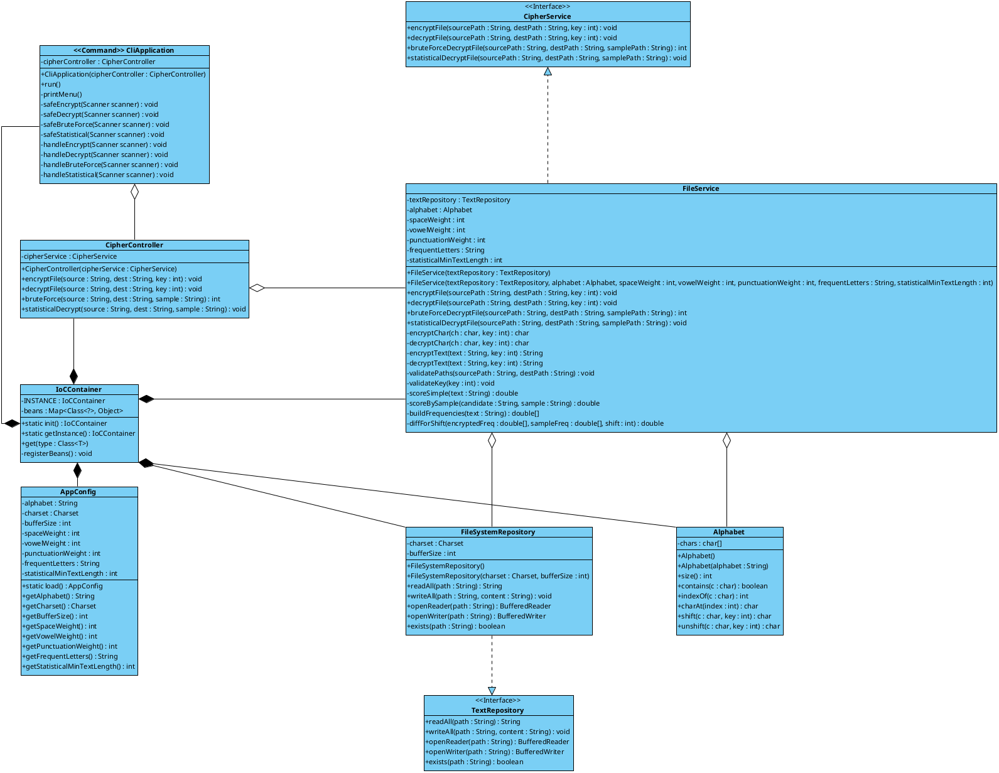
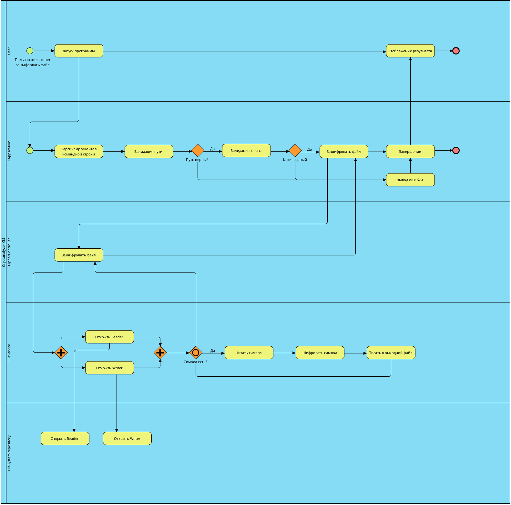
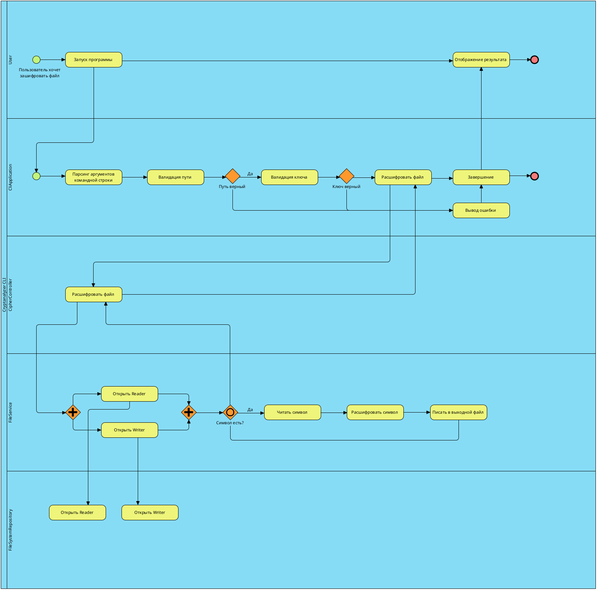
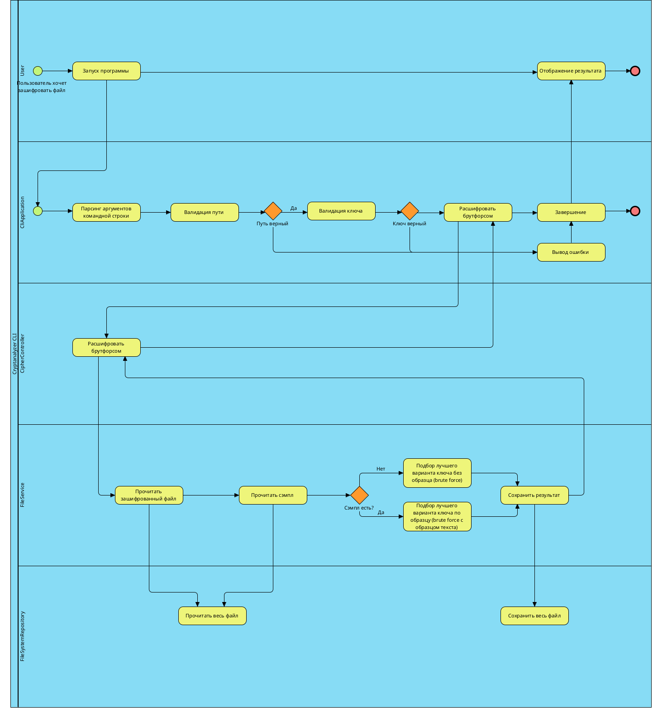
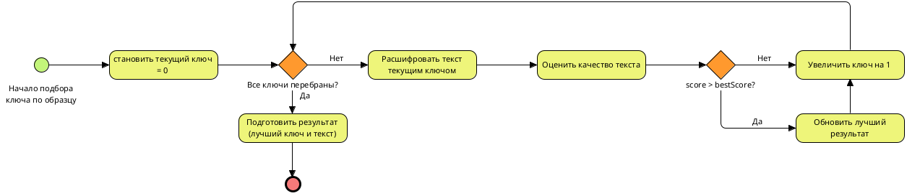
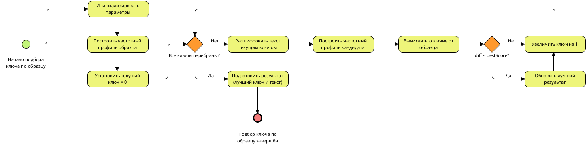
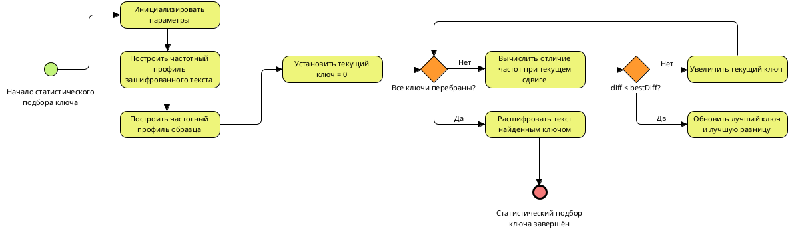

# Caesar Cryptanalyzer

## Описание приложения

Это консольное приложение для работы с шифром Цезаря.  
Программа позволяет шифровать и расшифровывать текстовые файлы, а также пробовать взлом шифра без знания ключа с помощью перебора и статистического анализа.

Проект создан как учебное задание по теме "Итоговый проект модуля 1".

## Что делает эта программа

Программа работает с текстом в файлах и поддерживает несколько режимов:

- **Шифрование текста**
    - читает исходный файл с текстом
    - шифрует его с помощью шифра Цезаря с указанным ключом (сдвигом по алфавиту)
    - записывает результат в новый файл

- **Расшифровка при известном ключе**
    - читает зашифрованный файл
    - расшифровывает текст, используя заданный ключ
    - сохраняет расшифрованный текст в отдельный файл

- **Brute force (подбор ключа)**
    - перебирает все возможные значения ключа
    - пытается найти вариант текста, который выглядит осмысленно
    - может использовать дополнительный "образцовый" текст того же автора для более точного подбора

- **Статистический анализ (опционально)**
    - сравнивает частоты символов в зашифрованном тексте с частотами символов в образцовом тексте
    - оценивает наиболее вероятный сдвиг
    - расшифровывает текст с найденным сдвигом

Дополнительно программа:

- проверяет существование файлов и корректность ключей
- поддерживает работу с большими текстовыми файлами
- обрабатывает ошибки ввода-вывода
- может быть расширена графическим интерфейсом (например, на JavaFX или Swing)

## Требования

### Функциональные требования

1. **Шифрование текста (Caesar cipher)**
  - программа читает исходный текст из файла.
  - шифрует текст с использованием шифра Цезаря и заданного ключа (сдвига).
  - записывает зашифрованный текст в выходной файл.

2. **Расшифровка текста при известном ключе**
  - программа читает зашифрованный текст из файла.
  - расшифровывает текст с использованием указанного ключа.
  - записывает результат в выходной файл.

3. **Расшифровка методом brute force**
  - перебор всех возможных значений ключа.
  - выбор наиболее подходящего варианта расшифровки (по простым эвристикам и/или репрезентативному тексту).
  - запись результата в выходной файл.

4. **Расшифровка методом статистического анализа (опционально)**
  - анализ частоты символов в зашифрованном тексте.
  - сравнение с частотами символов в репрезентативном тексте.
  - определение наиболее вероятного сдвига и расшифровка текста.

5. **Режимы работы**
  - запуск через консольное меню или CLI-команды.
  - поддержка режимов: encrypt, decrypt, brute force, statistical decrypt.

### Нефункциональные требования

1. **Работа с большими файлами**
  - поддержка обработки файлов большого объёма (десятки и сотни страниц).
  - использование механизмов Java NIO и буферизации.

2. **Валидация входных данных**
  - проверка существования входных файлов.
  - проверка допустимости ключа (с учётом размера алфавита).
  - проверка корректности путей к выходным файлам.

3. **Обработка ошибок**
  - чёткие сообщения об ошибках (файл не найден, ошибки чтения/записи, некорректный ключ и т.п.).
  - аккуратное завершение работы без падения программы.

4. **Расширяемость**
  - возможность добавить графический интерфейс (JavaFX/Swing) без изменения доменной логики.
  - возможность заменить формат хранения (например, работа не только с файлами, но и с потоками).

---

## Use Case (для проектирования)

### Актор

- **Пользователь** — запускает программу, выбирает режим, указывает файлы и ключи.

### UC-1: Шифрование текста

- **Цель:** получить зашифрованный файл на основе исходного текста и ключа.
- **Предусловия:** исходный файл существует, ключ указан.
- **Сценарий:**
  1. Пользователь выбирает режим шифрования.
  2. Вводит путь к исходному файлу, путь к выходному файлу и ключ.
  3. Приложение валидирует входные данные.
  4. Приложение считывает текст из файла.
  5. Доменный сервис шифрования выполняет преобразование по шифру Цезаря.
  6. Результат записывается в выходной файл.
  7. Пользователь получает сообщение об успешном завершении.

### UC-2: Расшифровка при известном ключе

- **Цель:** восстановить исходный текст из зашифрованного файла.
- **Предусловия:** зашифрованный файл существует, ключ известен.
- **Сценарий:**
  1. Пользователь выбирает режим расшифровки с ключом.
  2. Вводит путь к зашифрованному файлу, путь к выходному файлу и ключ.
  3. Приложение выполняет валидацию.
  4. Приложение считывает зашифрованный текст.
  5. Доменный сервис расшифровки выполняет обратный сдвиг.
  6. Результат сохраняется в выходной файл.

### UC-3: Расшифровка методом brute force

- **Цель:** получить читаемый текст без знания ключа.
- **Предусловия:** есть зашифрованный файл; опционально есть репрезентативный файл.
- **Сценарий:**
  1. Пользователь выбирает режим brute force.
  2. Указывает входной файл, выходной файл и (опционально) репрезентативный текст.
  3. Приложение валидирует пути.
  4. Доменный сервис brute force перебирает все ключи, оценивает качество результата.
  5. Выбирается лучший вариант расшифровки.
  6. Результат записывается в выходной файл.

### UC-4: Расшифровка методом статистического анализа

- **Цель:** автоматически определить ключ по статистике символов.
- **Предусловия:** есть зашифрованный файл и репрезентативный текст.
- **Сценарий:**
  1. Пользователь выбирает режим статистической расшифровки.
  2. Указывает файл с зашифрованным текстом, файл с репрезентативным текстом и выходной файл.
  3. Приложение валидирует данные.
  4. Доменный сервис статистического анализа строит частотные распределения и вычисляет наиболее вероятный сдвиг.
  5. Доменный сервис расшифровки применяет найденный ключ.
  6. Результат записывается в выходной файл.

---

## Архитектура (Hexagonal Architecture)

Архитектура проекта строится по принципам шестигранной (hexagonal, ports & adapters) архитектуры.

Проект разделён на три основных слоя:

- **domain** — чистая доменная логика (шифр Цезаря, алфавит, операции с текстом).
- **application** — «орchestrator»: обработка команд/режимов, работа через доменные порты.
- **infrastructure** — реализация доступа к файлам, настройка, репозитории и адаптеры.

Текущая структура (примерная):

```text
src
└── main
    ├── java
    │   └── com
    │       └── javarush
    │           ├── Main.java
    │           │   // Точка входа. Делегирует запуск в CliApplication.
    │           │
    │           ├── application
    │           │   ├── controllers
    │           │   │   // Контроллеры верхнего уровня (если появятся другие UI, кроме CLI)
    │           │   │
    │           │   ├── errors
    │           │   │   // Общие ошибки/исключения уровня приложения
    │           │   │
    │           │   └── handlers
    │           │       └── CliApplication.java
    │           │           // Входной адаптер (inbound).
    │           │           // Обрабатывает ввод из консоли, разбирает аргументы/команды,
    │           │           // вызывает доменные порты (интерфейсы в domain.ports.in).
    │           │
    │           ├── domain
    │           │   ├── aggregates
    │           │   │   // Доменные сущности и модели (алфавит, настройки шифра, результаты анализа и т.п.)
    │           │   │
    │           │   ├── FileService.java
    │           │   │   // Доменные операции над текстом:
    │           │   │   // шифрование, расшифровка, brute force, статистический анализ.
    │           │   │   // Не знает ни про файлы, ни про консоль – только про строки/символы.
    │           │   │
    │           │   └── ports
    │           │       ├── in
    │           │       │   // "Входные" порты: интерфейсы use case-уровня,
    │           │       │   // которые вызывает CliApplication (encrypt/decrypt/bruteforce/statistical).
    │           │       │
    │           │       └── out
    │           │           // "Выходные" порты: интерфейсы для работы с внешним миром
    │           │           // (чтение/запись текста, логирование и т.п.).
    │           │
    │           └── infrastructure
    │               ├── adapters
    │               │   // Реализации портов из domain.ports.out:
    │               │   // например, адаптер для работы с файловой системой через Java NIO.
    │               │
    │               ├── configuration
    │               │   // Сборка приложения: создание экземпляров доменных сервисов,
    │               │   // привязка портов к адаптерам (простая "ручная DI").
    │               │
    │               └── repository
    │                   // Репозитории для работы с текстом/файлами, если нужно выделить их отдельно.
    │
    └── resources
        application.yml
        // Конфигурационные файлы, если потребуется (например, настройки алфавита, кодировки и т.п.)

---
```
## Диаграммы

### Диаграмма компонентов

<a href="img/1.png">  </a>

На диаграмме показано разбиение приложения по слоям hexagonal-архитектуры:

- **Application** — слой приложения `CliApplication`, `CipherController`
- **Domain** — доменный сервис `FileService`, интерфейсы `CipherService`, `TextRepository`, сущность `Alphabet`
- **Infrastructure** — слой инфраструктуры`IoCContainer`, `AppConfig`, `FileSystemRepository`

Стрелки и required/provided-интерфейсы показывают, кто кого использует и какие порты реализуются.

---

### Диаграмма классов

<a href="img/2.png">  </a>

Диаграмма отражает:

- связи между `CliApplication`, `CipherController`, `FileService`, `IoCContainer`, `AppConfig`, `FileSystemRepository`, `Alphabet`
- интерфейсы `CipherService` и `TextRepository` и их реализации
- основные поля и методы классов (шифрование, расшифровка, brute force, статистика, работа с файлами).

---

### BPMN: Шифрование файла

<a href="img/3.png">  </a>

Диаграмма описывает бизнес-процесс **UC-1 «Шифрование текста»**:

- лейн **User** — запуск программы и получение результата;
- лейн **Сервисный слой** — парсинг аргументов, валидация путей и ключа, вызов операции «Зашифровать файл»;
- лейн **FileService** — чтение символов, шифрование каждого символа, запись в выходной файл;
- лейн **Инфраструктура** — открытие/закрытие `Reader`/`Writer`.

---

### BPMN: Расшифровка файла (общий процесс)

<a href="img/4.png">  </a>

Процесс **UC-3 «Расшифровка методом brute force»**:

- пользователь выбирает режим brute force и указывает файлы (и опционально — образец);
- приложение валидирует пути;
- сервис читает зашифрованный текст (и sample, если есть);
- вызывается задача «Подбор лучшего варианта ключа» (без или с образцом);
- лучший результат сохраняется в выходной файл.

---

### BPMN: Расшифровка файла брутфорсом (общий процесс)

<a href="img/4.png">  </a>

Процесс **UC-3 «Расшифровка методом brute force»**:

- пользователь выбирает режим brute force и указывает файлы (и опционально — образец);
- приложение валидирует пути;
- сервис читает зашифрованный текст (и sample, если есть);
- вызывается задача «Подбор лучшего варианта ключа» (без или с образцом);
- лучший результат сохраняется в выходной файл.

---

### BPMN: Внутренний алгоритм brute force

<a href="img/5.png">  </a>

Здесь детализируется логика метода `bruteForceDecryptFile`:

1. Инициализация `bestKey`, `bestScore`, `bestText`.
2. Цикл по всем возможным ключам от `0` до `alphabet.size() - 1`:
  - расшифровать текст текущим ключом;
  - оценить качество текста:
    - либо простой эвристикой (пробелы, гласные, пунктуация),
    - либо по образцу (сравнение частот);
  - если результат лучше текущего, обновить `bestKey`, `bestScore`, `bestText`.
3. По завершении цикла — сохранить текст с лучшим ключом.

---

### BPMN: Внутренний алгоритм brute force с сэмплом

<a href="img/5.png">  </a>

---

### BPMN: Статистическая расшифровка (общий процесс)


Диаграмма исключена так как похожа на все остальные

---

### BPMN: Внутренний статистический алгоритм

<a href="img/7.png">  </a>

Раскрытие метода `statisticalDecryptFile`:

1. Построить частотные профили зашифрованного текста и образца.
2. Инициализировать `bestKey` и `bestDiff`.
3. Для каждого возможного сдвига ключа:
  - посчитать отличие частот `diff` для данного сдвига;
  - если `diff` меньше `bestDiff`, обновить `bestDiff` и `bestKey`.
4. После цикла расшифровать текст найденным `bestKey`.
5. Вернуть расшифрованный текст для записи в файл.
